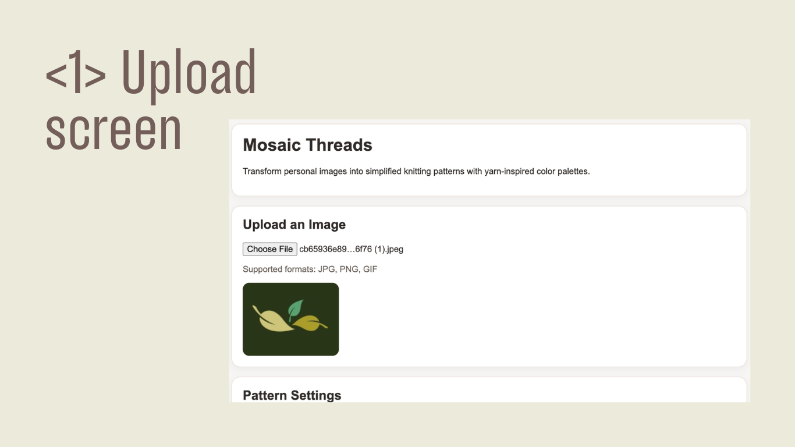
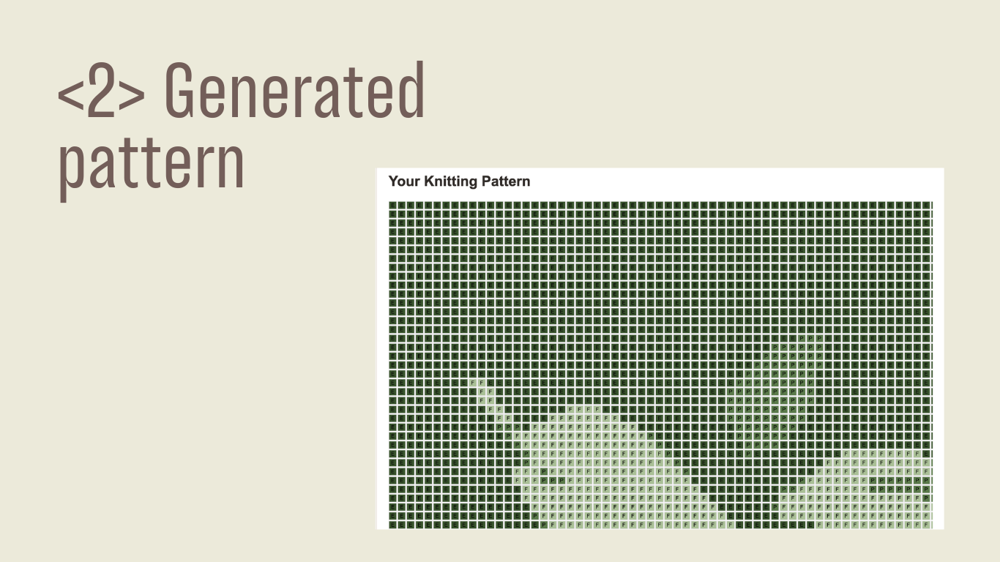
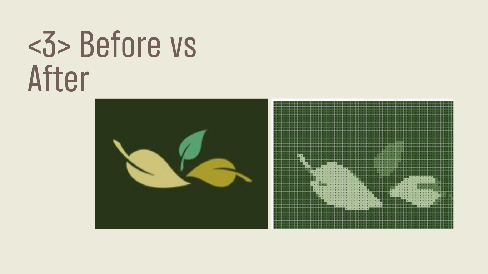
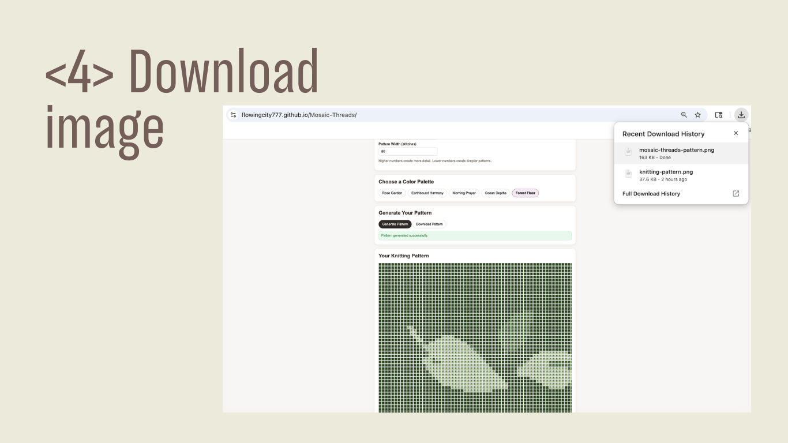

# 🧵 Mosaic Threads
### Transform personal images into simplified knitting patterns
### Mosaic Threads is a web-based tool that converts uploaded images into knittable color grid patterns using curated yarn-inspired palettes.

## **✨ Features**
**🖼️ Image Upload**
Upload JPG, PNG, or GIF images directly in the browser

**🎨 Yarn-Inspired Color Palettes**
Convert images into limited, harmonious color sets suitable for knitting

**🔲 Grid-Based Pattern Generation**
Automatically transforms images into stitch-by-stitch charts

**🧶 Pattern Simplification (Smoothing)**
Reduces noise and creates cleaner, more knit-friendly shapes

**📏 Custom Pattern Size**
Adjust pattern width (stitches) to control detail level

**📋 Knitting Instructions**
Stitch count and size estimation  
Color usage breakdown  
Row-by-row chart instructions  

**💾 Download as PNG**
Export your pattern as an image for offline use

## **🚀 How It Works**
Upload Image → Choose Palette → Adjust Size → Generate Pattern → Download

## **🧠 Design Philosophy**
Knitting is not pixel-perfect — it’s constraint-driven. 

This tool prioritizes: 

Simplicity over visual accuracy  
Limited colors over full-spectrum images  
Usability over perfection  

A good knitting pattern is one you can actually follow.

## **Tips for Best Results**
HTML5  
CSS3   
JavaScript (Vanilla)   
Canvas API (image processing)   

## **📸 Example Workflow**
Upload a photo (portrait, object, etc.)  
Select a color palette (e.g., Rose, Ocean, Forest)   
Choose pattern width (e.g., 40 stitches)   
Generate pattern   
Download and knit   
Experiment without manual charting.

## 📸 Screenshots
### Upload & Preview

### Pattern Generation

### Before vs After (Simplification)

### Downloaded Pattern Output

## **🚀 Product Roadmap**
### Phase 1 — Core Pattern Generation (Current)
Goal: Validate the core idea and usability

Image upload and preview
Color palette mapping (yarn-inspired palettes)
Grid-based pattern generation
Smoothing for readability
Row-by-row instructions
PNG export

✅ Status: Completed (MVP)

## **🌐 Live Demo**
**👉 https://flowingcity777.github.io/Mosaic-Threads/**

## **📌 Project Status**
Active prototype — continuously improving functionality and usability.

## **💭 Reflection**
This project explores how digital tools can translate meaningful images into physical, handmade creations.

It highlights the intersection of:

UX design
creative tools
real-world crafting constraints

## **🤝 Contributions**
Suggestions and feedback are welcome!

## **📄 License**
MIT License

© [Lydia Li/2025]. All rights reserved.  
**Unauthorized use, modification, or distribution is prohibited.** 
